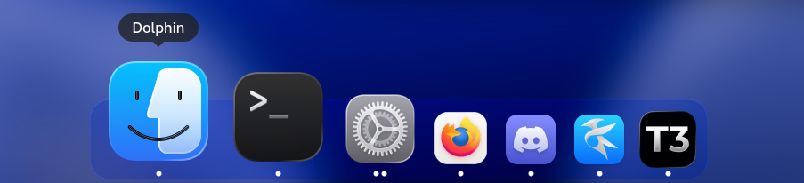

# Crystal Dock (Hard Fork)



This is a hard fork of [Crystal Dock](https://github.com/dangvd/crystal-dock) by Viet Dang. The original project is an excellent Wayland dock for Linux with parabolic zooming and multiple visual styles.

## What This Fork Improves

- **App-specific right-click menus** -- Right-clicking a dock icon shows the application's context menu with desktop actions (New Window, New Tab, New Private Window, etc.), window list, and pin/close options, similar to KDE Plasma's task manager
- **Shift+Right-click for dock settings** -- The panel settings menu is accessible via Shift+Right-click, keeping plain right-click for the app menu
- **Drag-to-reorder pinned launchers** -- Hold and drag pinned launcher icons to rearrange them with smooth animated icon sliding and parabolic zoom following the cursor, like macOS
- **Configurable bounce animation** -- Choose how many times icons bounce when launching an application
- **Fixed pill resizing** -- The dock background pill correctly resizes when items are added or removed
- **Glow effect on task indicators** -- Active/running task indicator dots have a glow effect with optional breathing animation (Animated Indicator setting)
- **Improved settings** -- Better organized and more accessible settings dialogs
- **Smooth enter/leave animations** -- Parabolic zoom ramps up smoothly on hover entry instead of popping in instantly
- **Smooth task add/remove animations** -- Dock pill resizes smoothly with fade in/out when windows open or close
- **Slide-to-hide animation** -- Auto-hide slides the dock off-screen instead of snapping it away

## Enabling Blur on the Dock

Crystal Dock does not handle blur on its own. For blur behind the dock panel, it is recommended to use **[Better Blur DX](https://github.com/taj-ny/kwin-effects-better-blur)** (a KWin effect for KDE Plasma).

To set it up:

1. Install Better Blur DX
2. In Better Blur DX settings, set the mode to **Blur all except matching**
3. Add `crystal-dock` to the **Force blur** list

This will give you a blurred translucent dock background.

## Dependencies

Crystal Dock is written in C++ and depends on:

- Qt6 (base, DBus, Gui, Widgets)
- LayerShellQt6
- Wayland client libraries
- KF6WindowSystem

### Installing build dependencies

**Arch Linux:**
```
pacman -S qt6-base wayland layer-shell-qt kwindowsystem
```

**Fedora:**
```
dnf install qt6-qtbase-private-devel wayland-devel layer-shell-qt-devel kf6-kwindowsystem-devel
```

**Ubuntu:**
```
apt install qt6-base-private-dev libwayland-dev liblayershellqtinterface-dev libkf6windowsystem-dev
```

**openSUSE:**
```
zypper install qt6-base-private-devel wayland-devel layer-shell-qt6-devel kf6-kwindowsystem-devel
```

## Installation

### Quick install (build + install + restart)

```
./install.sh
```

This builds a Release binary, copies it to `/usr/bin/crystal-dock`, and starts the dock.

### Manual build

```
cmake -S src -B build -DCMAKE_INSTALL_PREFIX=/usr
cmake --build build --parallel
sudo cmake --install build
```

Then launch from the application menu (Utilities) or from the terminal:

```
crystal-dock
```

### Uninstall

```
sudo cmake --build build --target uninstall
```

## License

Crystal Dock is licensed under the [GNU General Public License v3.0](LICENSE).
